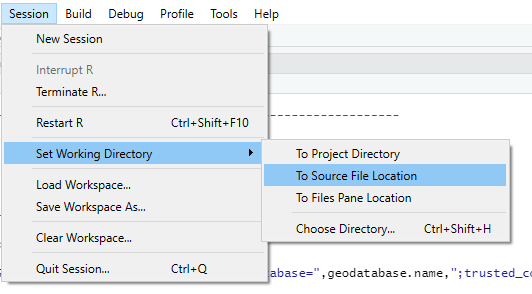

Welcome to map making in R! I am so excited you all are here to learn how to make interactive maps using one of my favorite packages, `leaflet` . In this lesson, we are going to work through a work-flow that many of us have done using ArcMap. We will:  

1. Connect to spatial layers via file, database and Arc-Online. 
2. Do some spatial analysis to trim our data.
3. Create a map with a few different spatial layers of standard types - `polyline, points and polygons`.

# Basic setup
The first step in our mapping journey will be the loading of our libraries and setting some variables that will be used throughout the code. For this lesson, we will be using *three* libraries:

1. `sf` - a packages for simple features that is the key package we will use for spatial analysis.
2. `dplyr` - our package for basic data manipulation as taught a few lessons ago.
3. `leaflet` - our package to create our interactive maps

Let's start a new RStudio session and if you like, go ahead and copy and paste this code into RStudio.

``` {r eval=FALSE, echo=TRUE}

# Libraries ---------------------------------------------------------------

library(sf)
library(dplyr)
library(leaflet)


# General Inputs ----------------------------------------------------------

geodatabase.server <- "AWS-PROD-SQL\\Sockeye"
geodatabase.name <- "ElmerGeo"
gdb.nm <- paste0("MSSQL:server=",geodatabase.server,";database=",geodatabase.name,";trusted_connection=yes")

spn <- 2285
wgs84 <- 4326

current.city <- "Poulsbo"

```
We should also set our `working directory` to the location of our main script by doing  
<br>
{width=50%} 

# Loading Spatial Data
You can read data from all sorts of file types with `sf`. These include:

1. Databases (like ElmerGeo)
2. Shapefiles
3. From the web (like ArcOnline)

Let's go ahead and show an example of each to start.

## Loading from ElmerGeo
First, lets load a spatial layer from ElmerGeo using sf. This is done using the "st_read" command from sf with the following parameters:

1. The database connection string which in this case is stored in the variable `gbd.nm`. This string contains the credentials needed to access ElmerGeo including the server name and the database name. One important thing to note - "MSSQL:" defines the driver that R will use when it connects to the database. This driver definition is important to ensure that R connects properly. If you are using other database types, this driver definition will be different.

2. The name of the layer you want to read. For this example we are reading in the city boundaries. Note the "dbo." at the start of the layer name - that is the schema of the layer.

3. st_read needs to know the `crs` (coordinate reference system) of the layer so it can project it properly. For all data sources in ElmerGeo, the `crs` is Washington State Plane North FIPS Feet. In the world of `crs`, an `espg` code is all that is needed.  The EPSG Geodetic Parameter Dataset is a public registry of spatial reference systems, Earth ellipsoids, coordinate transformations and related units of measurement. Each entity is assigned an `epsg`code between 1024-32767, along with a standard machine-readable well-known text representation. You can look them up online but  WA North Feet is "2285" and WGS84 is "4326".
``` {r eval=FALSE, echo=TRUE}

my.city <- st_read(gdb.nm, "dbo.cities", crs = spn)

```

### Trim dataset using dplyr
Take a look at `my.city` using `head(my.city)`. You should see that the data has `9 fields` in it, the same as you would see if you looked at the layer in ArcMap. It also tells you information about the type of `simple feature` it is and things like the `crs`. What if we only want to keep a column or two out of this (imagine that the bigger the file, the more memory it consumes)? You can perform operations on a `sf` object the same as if it was a tibble or a dataframe. Let's use `dplyr` to `select` a single column and `filter` the rows to only include our `current.city` 
``` {r eval=FALSE, echo=TRUE}

my.city <- my.city %>% 
  filter(city_name == current.city) %>% 
  select(city_name)

```

### Query dataset in SQL before loading
Imagine you are pulling a parcels shapefile with 1.3 million rows and 30 some columns from ElmerGeo. The time to transfer that file over the network will be slow and the larger the file, the slower it is. With `st_read`, you can actually query the data first before you download which saves time. It is not noticeable on this data-set but is on much larger ones. You do this by:
``` {r eval=FALSE, echo=TRUE}

my.city <- st_read(dsn = gdb.nm,
                   layer = "dbo.cities",
                   query = paste0("SELECT city_name, Shape FROM cities WHERE city_name = " , "'",current.city,"'"),
                   crs = spn)

```

## Loading from File
You can also connect `sf` to a shapefile on disk if that is the way the data is stored. You still use `st_read` and the syntax is very similar. Let's read in one of the files that were copied to your local drive for this. Be sure that the files are in the same directory as your code for this to work properly. Loading time is much faster without the network connection via vpn.
``` {r eval=FALSE, echo=TRUE}

my.city <- st_read("cities.shp") %>% 
  filter(city_name == current.city) %>% 
  select(city_name)

```

## Loading from ArcOnline
You can also connect `sf` to a shapefile on ArcOnline if that is where the data is stored. The reading process is similar but instead of a files path or database connection, you use the unique ulr for the dataset from ArcOnline.
``` {r eval=FALSE, echo=TRUE}

city.url <- "https://services6.arcgis.com/GWxg6t7KXELn1thE/arcgis/rest/services/cities/FeatureServer/0/query?where=0=0&outFields=*&f=pgeojson"

my.city <- st_read(city.url) 

```

Using head, you can take a look at this layer `head(my.city)`. The column names are slightly different and the `crs` is not our standard ElmerGeo stateplane north. Lets trim this down to the `CITYNAME` column and transform it to State Plane North so it works with our other layers. We should also rename the column to `city_name` so that it is the same as our other data-sets.
``` {r eval=FALSE, echo=TRUE}

my.city <- my.city %>% 
  filter(CITYNAME == current.city) %>% 
  select(CITYNAME) %>%
  st_transform(spn) %>%
  rename(city_name = CITYNAME)
  
```

Once again use `head(my.city)` to see the columns and `crs`.

# Spatial Operations
Now that we have a `city boundary`, lets go ahead and get some other data-sets to display. Let's start off with the `its_signals` data that Gary worked so hard to collect, clean, process and put in ElmerGeo for all of us to use. The file is in `ElmerGeo` but  also provided with the other class resources. Let's load it from disk to save a bit of time.
``` {r eval=FALSE, echo=TRUE}

signals <- st_read("its_signals.shp")

```

Once again, you can use `head(signals)` to see basic information about the data-set. Let's go ahead and select a few columns out of the 25 fields in the data.
``` {r eval=FALSE, echo=TRUE}

signals <- st_read("its_signals.shp") %>%
  select(owner, majorst_1, ped_signal, tsp) %>%
  st_transform(spn)

```

There are 2560 features in this data. What if we only want to see the signals that are in our city? We could filter by a column if we trust that the data is accurate, but we can also use spatial analysis to select them. Let's go ahead and use an spatial intersection of `my.city` and `signals` to select only those signals located within our `current.city`. The `sf` function we want to use for this is `st_intersection`.

**Note of Caution**  
Always ensure that the `crs` of your layers match. Since both are coming from GeoElmer, I know they are both State Plane but we can always use `st_transform` to ensure that they match. For `st_intersection` to work, your layers have to be in a projected coordinate system.
``` {r eval=FALSE, echo=TRUE}

signals <- st_read("its_signals.shp") %>%
  select(owner, majorst_1, ped_signal, tsp) %>%
  st_transform(spn)

my.city <- st_read("cities.shp") %>% 
  filter(city_name == current.city) %>% 
  select(city_name) %>%
  st_transform(spn)

city.signals <- st_intersection(signals, my.city)

```

Now take a look at `city.signals`. There are now 9 signals in the data and the city name is Poulsbo for all of them. If you want to see them plotted, use `plot(city.signals)`. One caution, you will see a plot for every field/attribute in the data.

## Getting Ready to map
There is one interesting/frustrating thing to know about mapping and the `crs`. As noted above, to perform spatial analysis you need to use a projected coordinate system. To map in `leaflet` you can use any `crs` but if you want to use their wonderful background maps, you need your data to be in `WGS84`. This is simple to do in `r` but is one more line of code. Let's just add it to what we already did above.
``` {r eval=FALSE, echo=TRUE}

signals <- st_read("its_signals.shp") %>%
  select(owner, majorst_1, ped_signal, tsp) %>%
  st_transform(spn)

my.city <- st_read("cities.shp") %>% 
  filter(city_name == current.city) %>% 
  select(city_name) %>%
  st_transform(spn)

city.signals <- st_intersection(signals, my.city) %>%
  st_transform(wgs84)

```

# Other Layers
Following the same process we have up to now, we can also load in `transit routes`. We could just copy and paste the code, but what if we decided to add another layer atfer this? Why don't we create a function that:  

1. Reads in a layer  
2. Trims columns  
3. Intersects layers  
4. Re-projects data for mapping  

This function could look like:
``` {r eval=FALSE, echo=TRUE}

intersect.layers <- function(a.layer, a.columns, overlay, intersect.crs=spn, final.crs=wgs84) {
  
  data <- st_read(a.layer) %>%
    select(all_of(a.columns)) %>%
    st_transform(intersect.crs)
  
  trimmed <- st_intersection(data, overlay) %>%
    st_transform(final.crs)
  
  return(trimmed)
}

```

Let's use our new function to get a few layers ready for mapping. We will also go ahead and transform `my.city` to `wgs84` so it can be used in our map making.
``` {r eval=FALSE, echo=TRUE}

city.signals <- intersect.layers("its_signals.shp", c("owner", "majorst_1", "ped_signal", "tsp"), my.city)
city.transit <- intersect.layers("transit_lines.shp", c("trans_line", "mode"), my.city)
my.city <- my.city %>% st_transform(wgs84)

```

Now that we have spatial layers, let's move on to creating a map with `leaflet` in `Lesson #2`!