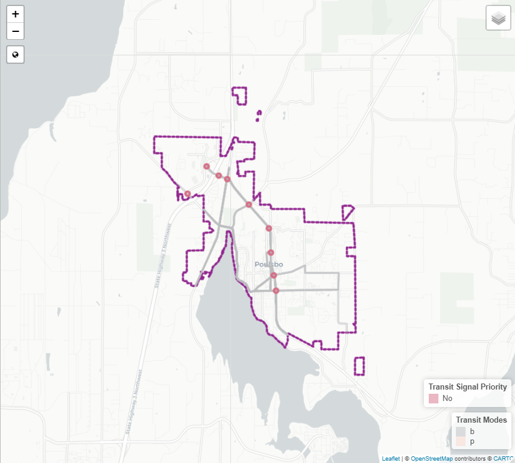
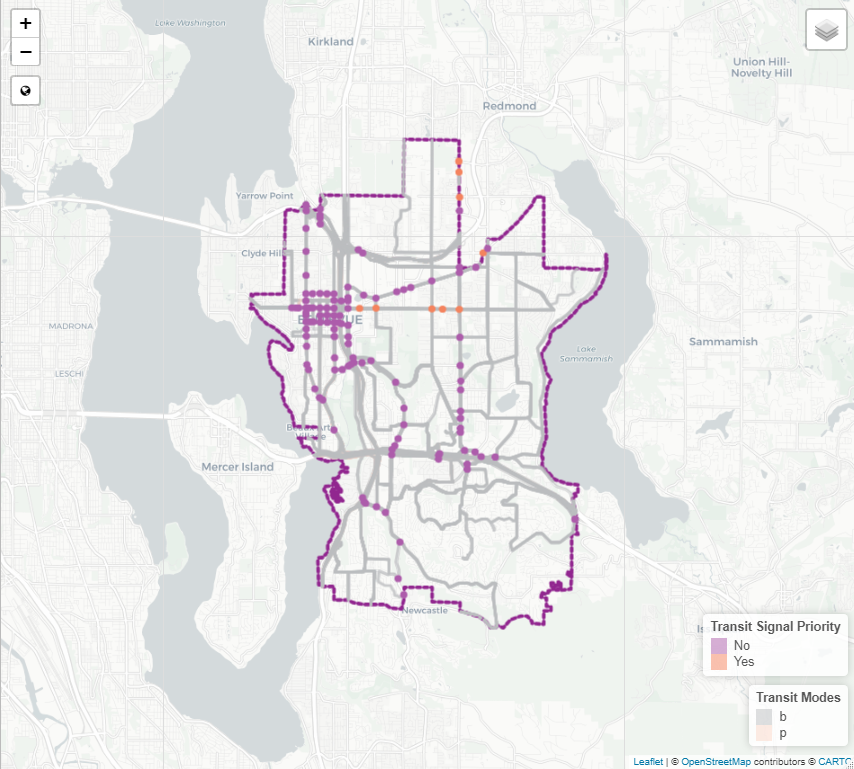
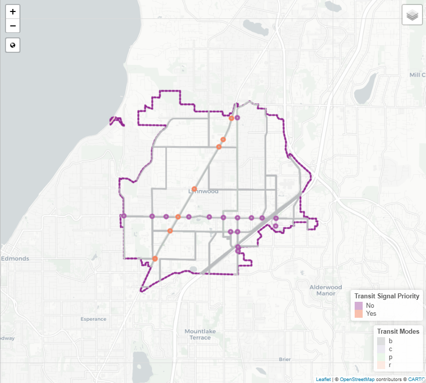
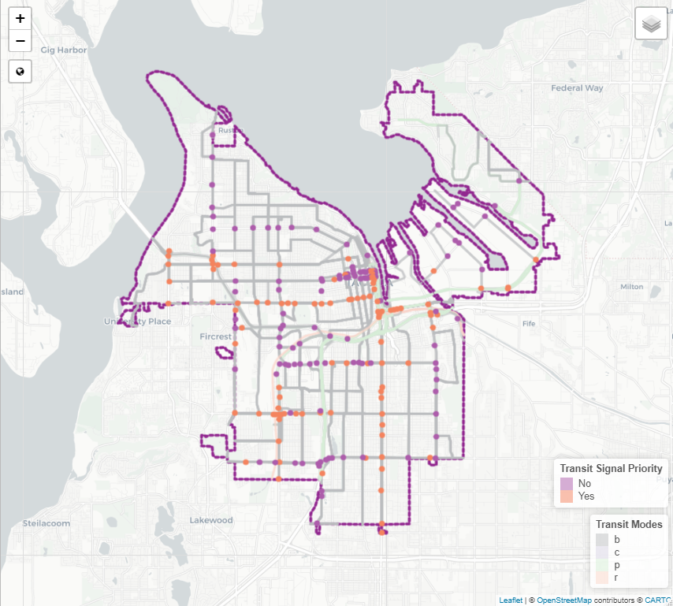

Now that we completed `Lesson #1`, we should have `three` layers to create a map with. These layers consist of a `a city (polygon)`, `traffic signals within our city (points)` and `transit routes in our city (polylines)`. If you fell behind in `Lesson #1` or are doing this one again, feel free to copy and paste the `working code` from the first lesson here.

# Lesson #1 Code

``` {r eval=FALSE, echo=TRUE}


# Libraries ---------------------------------------------------------------

library(sf)
library(dplyr)
library(leaflet)


# General Inputs ----------------------------------------------------------

geodatabase.server <- "AWS-PROD-SQL\\Sockeye"
geodatabase.name <- "ElmerGeo"
gdb.nm <- paste0("MSSQL:server=",geodatabase.server,";database=",geodatabase.name,";trusted_connection=yes")

spn <- 2285
wgs84 <- 4326

current.city <- "Poulsbo"

# Create a function for spatial layers ------------------------------------
intersect.layers <- function(a.layer, a.columns, overlay, intersect.crs=spn, final.crs=wgs84, trim='y', trim.cols='') {
  
  data <- st_read(a.layer) %>%
    select(all_of(a.columns)) %>%
    st_transform(intersect.crs)
  
  if (trim == 'y') {
    trimmed <- st_intersection(data, overlay) %>%
      st_transform(final.crs)
    
  } else {
    overlapping.features <- st_intersection(data, overlay) %>% pull(trim.cols)
    
    trimmed <- data %>%
      filter(.data[[trim.cols]] %in% overlapping.features) %>%
      st_transform(final.crs)
    
  }
  
  return(trimmed)
}

# Create layers for mapping -----------------------------------------------
my.city <- st_read("cities.shp") %>% 
  filter(city_name == current.city) %>% 
  select(city_name) %>%
  st_transform(spn)

city.signals <- intersect.layers("its_signals.shp", c("owner", "majorst_1", "ped_signal", "tsp"), my.city)
city.transit <- intersect.layers("transit_lines.shp", c("OBJECTID","trans_line", "mode"), my.city, trim='n', trim.cols = 'OBJECTID')
my.city <- my.city %>% st_transform(wgs84)

```

# Create a Base Map
The first thing I like to do in `leaflet` is create a background map with the elements I am interested in including. If you were with us for Christy's excellent overview of `ggplot2`, you will notice some syntax similarities with `leaflet`. Let's start by creating a `leaflet` object with a nice background map.

``` {r, eval=FALSE, echo=TRUE}

my.map <- leaflet() %>% 
  addProviderTiles(providers$CartoDB.Positron)

```

To view the map in `RStudio`, all you need to do is type `my.map` in the interactive console. You should see a map of the world with very little stuff on it. Feel free to zoom in and interact with it. Now let's add a few features to our map.

## Add layer controls
Let's create a layer control that will allow us to turn our layers on/off. For now this doesn't do anything but you will see the functionality soon. If you want the control box to `collapse` until it is hovered on, set `collapsed=TRUE`. If you want it to always be on then set `collapsed=FALSE`.
``` {r, eval=FALSE, echo=TRUE}

my.map <- my.map %>% 
  addLayersControl(baseGroups = c("Base Map"),
                   overlayGroups = c("City Boundary","Signals","Transit Routes"),
                   options = layersControlOptions(collapsed = TRUE))

```

## Add a Region Zoom Button
Now let's add a button that when clicked will always return you to a `setView`.  The latitude and longitude zoom level center on our region. If you want to see the `Awesome Fnts` you can use, check out <https://fontawesome.com/icons?d=gallery&p=2> and look at the free fonts you can use for all your leaflet maps. These are called with the `icon="fa-" command.
``` {r, eval=FALSE, echo=TRUE}

my.map <- my.map %>%
  addEasyButton(easyButton(
    icon="fa-globe", title="Region",
    onClick=JS("function(btn, map){map.setView([47.615,-122.257],8.5); }")))

```

## Add City Polygon
Now that we have some basic items added, let's go ahead and add our `city polygon` to our map. Just like `ggplot2`, there are lots of different attributes you can change. The ones I use the most are:

* `fillColor`
* `fillOpacity` (how transparent the polygon is)
* `weight` (width of the polygon boundary)
* `color` (color of the polygon boundary) 
* `dashArray` (line type)

``` {r, eval=FALSE, echo=TRUE}

my.map <- my.map %>% 
  addPolygons(data=my.city,
              fillColor = "E3C9E3",
              fillOpacity = 0.0,
              opacity = 1,
              weight = 4,
              color = "#91268F",
              dashArray = "4",
              group = "City Boundary")

```

Note how the map auto-zoomed to the limits of the polygon. Click on the `region` button and you will zoom out to your full region map.

## Add Traffic Signals
Now let's add our point layer `city.signals`. This is done in `leaflet` using the `addCircles` command. There are some unique settings to use with `addCircles` that include:

* `radius`
* `popup`
``` {r, eval=FALSE, echo=TRUE}

my.map <- my.map %>%
  addCircles(data=city.signals,
             weight = 4, 
             radius = 48,
             fill = TRUE,
             opacity = 1,
             popup = ~tsp,
             color = ~tsp.colors(tsp),
             group = ("Signals"))
```

Notice the command `color = ~tsp_colors(tsp)`. This assigns colors from the factors we loaded in `tsp_colors` based on the values of the column `tsp`.

## Add a Legend
What map is complete without a legend. This one will be a bit boring right now, but let's go ahead and add a legend using `addLegend`. First things first, let's create the `color palette` that will work with our signal data. The `color palette` will define the colors to display based on the values in our data.

``` {r, eval=FALSE, echo=TRUE}

signal.pal <- colorFactor(
  palette = c("#AD5CAB", "#F4835E"),
  domain = city.signals$tsp
)

my.map <- my.map %>%
  addLegend(pal = signal.pal,
            values = city.signals$tsp,
            group = "Signals",
            position = "bottomright",
            title = "Transit Signal Priority")
  

```

## Add Transit Routes
Now that we have added a `polygon` and a `point`, let's complete our test case with a `polyline` feature. Once again the syntax is similar, but this time we `addPolylines`. We will also add in a `color palette` for our `transit routes` and also add another legend.

``` {r, eval=FALSE, echo=TRUE}
transit.pal <- colorFactor(
  palette = c("#BCBEC0", "#E3C9E3", "#BFE9E7", "#E2F1CF", "#FBD6C9"),
  domain = city.transit$mode
)

my.map <- my.map %>%
  addPolylines(data = city.transit,
               color = ~transit.pal(mode),
               weight = 3,
               fillColor = ~transit.pal(mode),
               group = "Transit Routes") %>%
  
  addLegend(position = "bottomright",
            values = city.transit$mode,
            pal = transit.pal,
            title = "Transit Modes",
            group = "Transit Routes")
  
```

If you wanted to add more layers, you can keep repeating these same steps until you get everything that you want. Now let's see all that in one code chunk we can use for our city map.

``` {r, eval=FALSE, echo=TRUE}

signal.pal <- colorFactor(
  palette = c("#AD5CAB", "#F4835E"),
  domain = city.signals$tsp
)

transit.pal <- colorFactor(
  palette = c("#BCBEC0", "#E3C9E3", "#BFE9E7", "#E2F1CF", "#FBD6C9"),
  domain = city.transit$mode
)

my.map <- leaflet() %>% 
  addProviderTiles(providers$CartoDB.Positron) %>%
  
  addLayersControl(baseGroups = c("Base Map"),
                   overlayGroups = c("City Boundary","Signals","Transit Routes"),
                   options = layersControlOptions(collapsed = TRUE)) %>%
  
  addEasyButton(easyButton(
    icon="fa-globe", title="Region",
    onClick=JS("function(btn, map){map.setView([47.615,-122.257],8.5); }"))) %>%

  addPolygons(data=my.city,
              fillColor = "76787A",
              fillOpacity = 0.0,
              opacity = 1.0,
              weight = 4,
              color = "#91268F",
              dashArray = "4",
              group = "City Boundary") %>%
  
  addPolylines(data = city.transit,
               color = ~transit.pal(mode),
               weight = 3,
               fillColor = ~transit.pal(mode),
               group = "Transit Routes") %>%
  
  addLegend(position = "bottomright",
            values = city.transit$mode,
            pal = transit.pal,
            title = "Transit Modes",
            group = "Transit Routes") %>%
  
  addCircles(data=city.signals,
             weight = 4, 
             radius = 48,
             fill = TRUE,
             opacity = 1,
             popup = ~tsp,
             color = ~signal.pal(tsp),
             group = ("Signals")) %>%
  
  addLegend(pal = signal.pal,
            values = city.signals$tsp,
            group = "Signals",
            position = "bottomright",
            title = "Transit Signal Priority")
  
```

# Other Cities
Now try your code for `Bellevue`, `Lynnwood`, and `Tacoma`. When ou are all done, you should have four maps that look something like this: <br>
{width=40%}  {width=40%} <br>
{width=40%}  {width=40%} <br>
